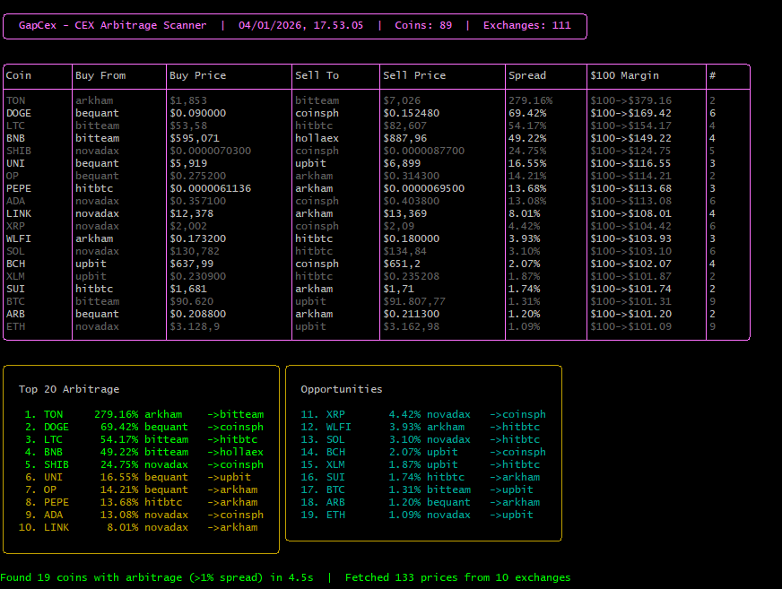

# GapCex

CEX arbitrage scanner utilizing ccxt to find price gaps and check arbitrage opportunities across 100+ crypto exchanges.

## Features

- Scans 89 top coins by market cap
- Checks 111+ centralized exchanges
- Fast parallel fetching (~4-5 seconds)
- Real-time progress display
- **Compact & Clean CLI Output** with styled tables
- **Top 20 Arbitrage Opportunities** in a dual-column layout
- **$100 Margin Simulation** showing potential return (e.g., $100 -> $169)
- **Live Timestamp** in header for tracking scans

## Installation

```bash
pnpm install
```

## Usage

```bash
pnpm start
```

## Screenshot



## Sample Output

```
╭───────────────────────────────────────────────────────────────────────────────────╮
│  GapCex - CEX Arbitrage Scanner  |  04/01/2026, 17:44:58  |  Coins: 89  | ...     │
╰───────────────────────────────────────────────────────────────────────────────────╯

╭───────────┬─────────────┬─────────────┬────────────┬─────────────┬─────────────┬────────────────┬───╮
│ Coin      │ Buy From    │ Buy Price   │ Sell To    │ Sell Price  │ Spread      │ $100 Margin    │ # │
├───────────┼─────────────┼─────────────┼────────────┼─────────────┼─────────────┼────────────────┼───┤
│ DOGE      │ bequant     │ $0.09       │ coinsph    │ $0.15       │ 69.28%      │ $100->$169.28  │ 7 │
│ LTC       │ bitteam     │ $53.58      │ hitbtc     │ $82.58      │ 54.14%      │ $100->$154.14  │ 4 │
╰───────────┴─────────────┴─────────────┴────────────┴─────────────┴─────────────┴────────────────┴───╯

╭───────────────────────────────────────────╮╭───────────────────────────────────────────╮
│  Top 20 Arbitrage                         ││  Opportunities                            │
│   1. DOGE     69.28% bequant   ->coinsph  ││  11. OP       14.28% bequant   ->arkham   │
│   2. LTC      54.14% bitteam   ->hitbtc   ││  12. ADA      12.97% novadax   ->upbit    │
╰───────────────────────────────────────────╯╰───────────────────────────────────────────╯

Found 29 coins with arbitrage (>1% spread) in 4.5s  |  Fetched 190 prices from 12 exchanges
```

## Dependencies

- [ccxt](https://github.com/ccxt/ccxt) - CryptoCurrency eXchange Trading Library
- [charsm](https://github.com/sklyt/charsm) - Terminal styling (Lipgloss WASM port)

## Disclaimer

This tool is for informational purposes only. High spread percentages may indicate low liquidity, data errors, or different token versions. Always verify manually before trading.

## Donation

EVM Address (xppaicyber.base.eth | xppaicyber.eth):
`0xE11018C82D4405bDBc7414eC988Fd08351666666`

## License

MIT
